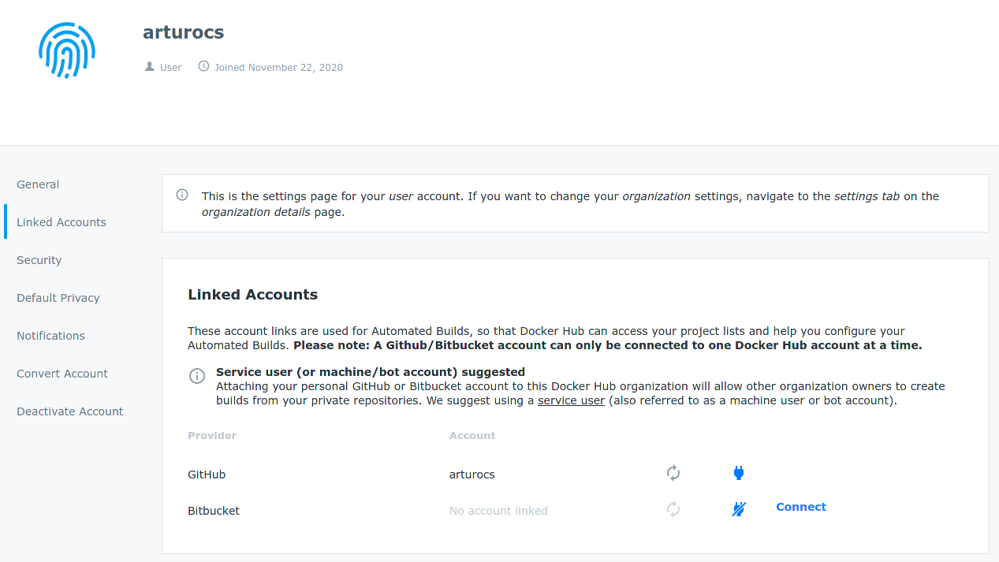
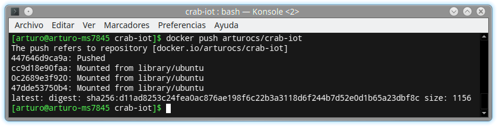
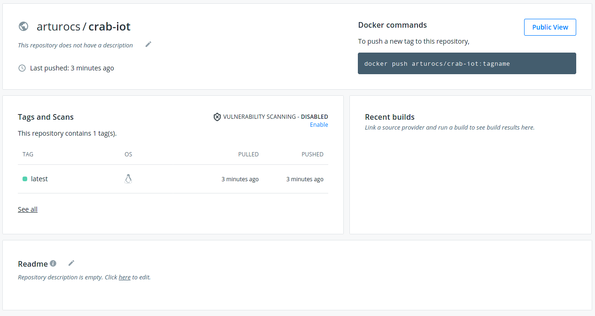
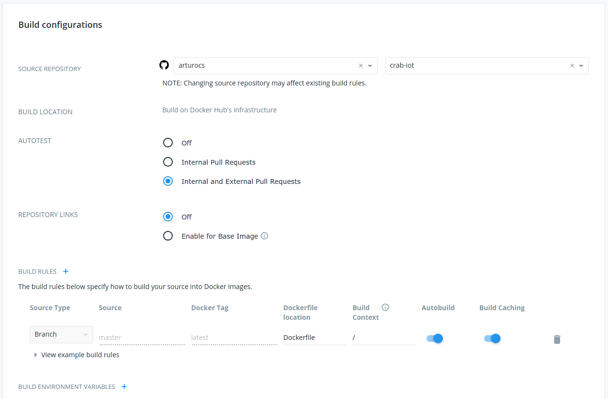
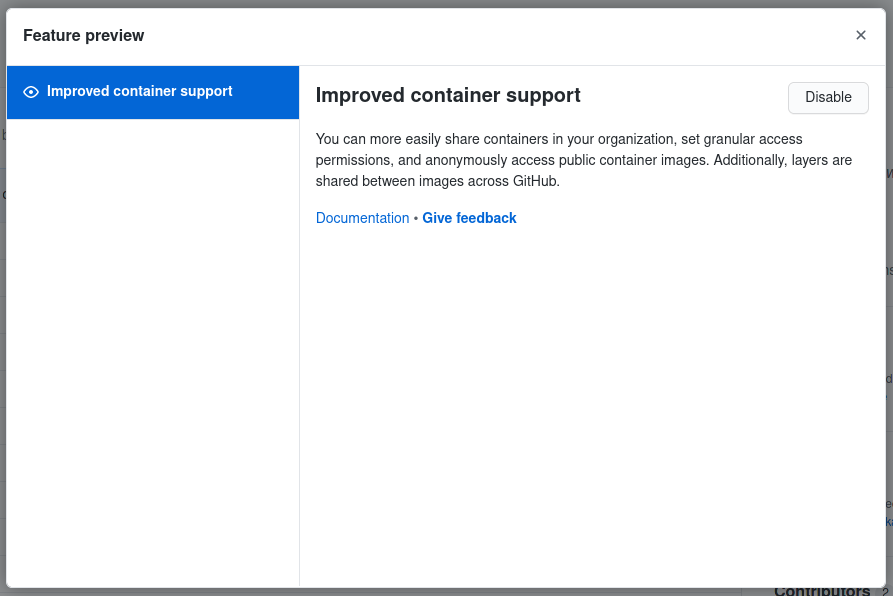
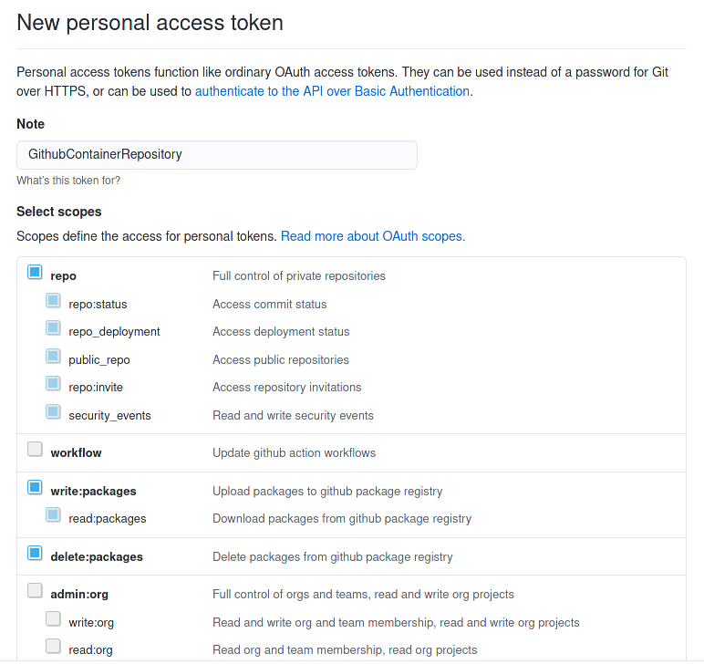
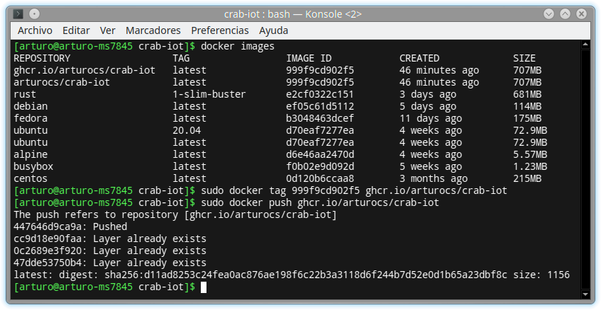
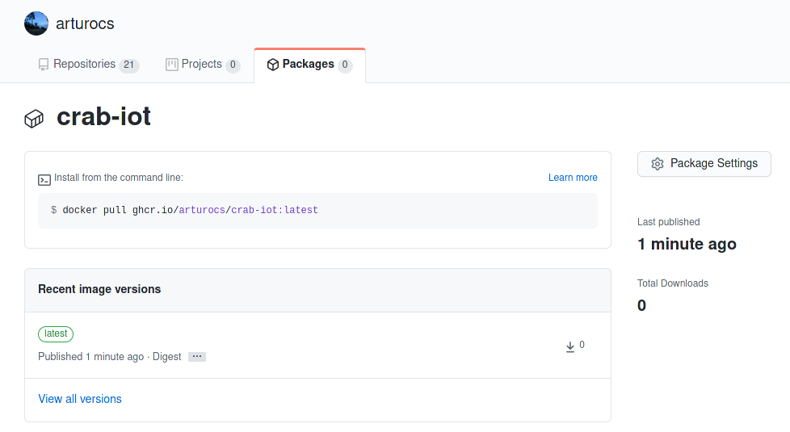

## Justificación de la imagen base elegida


Inicialmente había considerado usar las imágenes oficiales de Rust, pero descargar las tres variantes que ofrecen, me di cuenta de que ninguna de ellas era precisamente pequeña. 

```
[arturo@arturo-ms7845 crab-iot]$ docker images
REPOSITORY                 TAG                 IMAGE ID            CREATED             SIZE
rust                       alpine              aeced591196c        3 days ago          642MB
rust                       1-slim-buster       e2cf0322c151        3 days ago          681MB
rust                       latest              a4b51fc0e875        3 days ago          1.29GB
```

Así que empecé a comparar tamaños de distintas imágenes populares.

```
[arturo@arturo-ms7845 crab-iot]$ docker images
REPOSITORY                 TAG                 IMAGE ID            CREATED             SIZE
debian                   latest              ef05c61d5112        5 days ago          114MB
fedora                   latest              b3048463dcef        11 days ago         175MB
ubuntu                   latest              d70eaf7277ea        4 weeks ago         72.9MB
alpine                   latest              d6e46aa2470d        4 weeks ago         5.57MB
busybox                  latest              f0b02e9d092d        5 weeks ago         1.23MB
centos                   latest              0d120b6ccaa8        3 months ago        215MB
```

En un principio decidí utilizar la imagen de Busybox, pero no tardé en darme cuenta de que no era viable, así que pasé a considerar la siguiente imagen mas pequeña, Alpine. El problema es que ya sabía cuanto iba a ocupar dicha imagen, pues entre las imágenes oficiales de Rust, ya hay imágenes de Alpine. Así que tratando de explorar otras posibilidades finalmente me decanté por una imagen de la ultima LTS Ubuntu, cuya imagen base se sitúa en unos razonables 73MB. De esta forma obtendría una imagen de tamaño pequeño-mediano, con gran soporte comunitario y cuyas herramientas son sobradamente conocidas.

## Actualización automática

Nos registramos en docker hub y enlazamos la cuenta de github:




Iniciamos sesión en docker y subimos la imagen:





Activamos el servicio de actualización automática:



## Registros alternativos

Para poder usar Github Container Registry hay que activar la funcionalidad, ya que aun está en beta.



También hay que generar un token



Una vez tenemos el token podemos usarlo para iniciar sesión con:

```
sudo docker login ghcr.io -u arturocs
```

Con la sesión ya iniciada en docker podemos hacer push de la imagen a Github Container Registry



Cuando acabe de subirse la imagen podemos comprobar que se ha generado un nuevo paquete:

